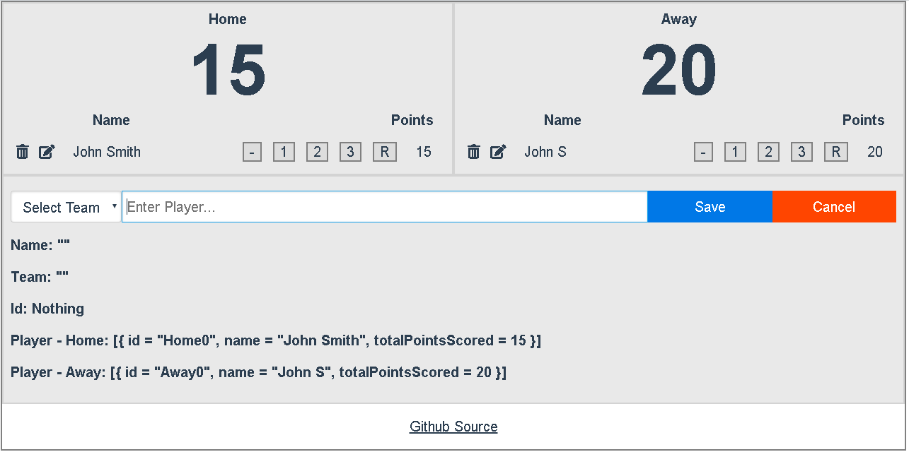

## Scorekeeper Improved

My own take on learning Elm using [Knowthen's](https://github.com/knowthen/elm) Elm tutorial.

Visit the [Demo](https://jaeyson.github.io/score-keeper-improved/)

files used:

- [`index.html`](https://github.com/jaeyson/score-keeper-improved/blob/master/index.html)
- [`src/Main.elm`](https://github.com/jaeyson/score-keeper-improved/blob/master/src/Main.elm)
- I haven't used [`elm-ui`](https://github.com/mdgriffith/elm-ui/tree/1.1.0) or [`elm-css`](https://github.com/rtfeldman/elm-css) yet but planning to learn it once I fully grasp TEA.

[//]: # "Work in Progress"
[//]: # "Visit the [Demo](https://gitcdn.xyz/repo/jaeyson/score-keeper-improved/master/index.html)"
